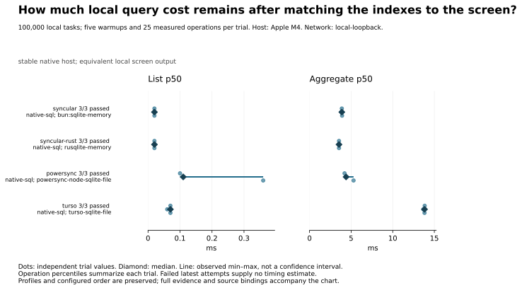
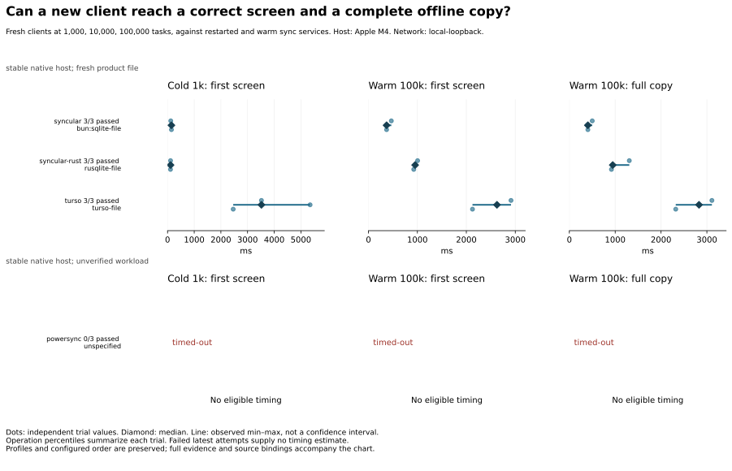
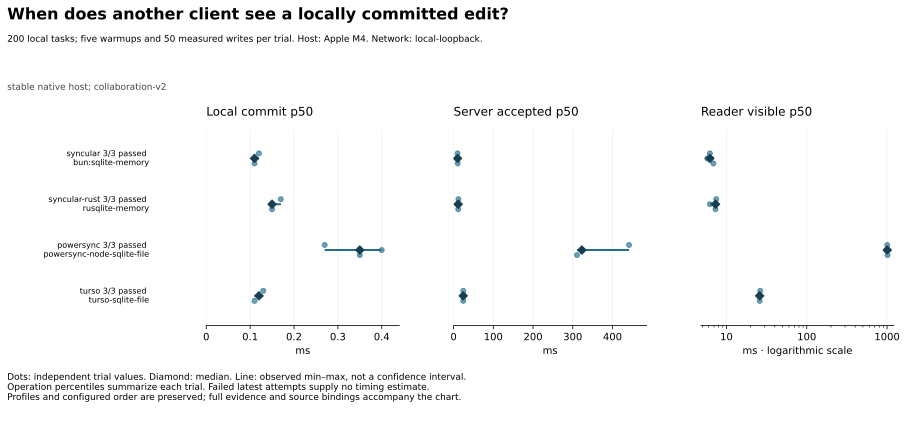

# Benchmark results

**Across the four tuned SQL clients, median list p50 spans 0.02–0.11 ms; aggregate-query p50 spans 3.54–13.82 ms.**

Inspect plans for the actual filters and ordering. The list differences here fall below the declared 1 ms practical threshold. Aggregation has a larger absolute gap and deserves attention when it sits on an application’s critical path.

Campaign `campaign-2026-09-08T22-58-56-419Z`: 3 independent trials per case, in seeded randomized order. Network: local service routes, no injected delay or loss. Host: Apple M4.

[Full tables and explanations](results/reports/campaign-2026-09-08T22-58-56-419Z/DETAILS.md) · [Raw measurements](archive/files/RESULTS.json.gz) · [Methodology](docs/methodology.md)

## Coverage and outcomes

| Suite | syncular | syncular-rust | powersync | turso |
| --- | --- | --- | --- | --- |
| Startup | 2 passed | 2 passed | 2 timed out; 6 failed trials | 2 passed; 1 failed trials |
| Collaboration | 1 passed | 1 passed | 1 passed | 1 passed |
| Offline recovery | 5 passed | 5 passed | 5 invalid; 15 failed trials | 5 passed |
| Local screens | 2 passed | 2 passed | 2 passed | 2 passed |
| Client fanout and recovery | 2 passed | 2 passed | 2 invalid; 6 failed trials | 2 passed; 2 failed trials |
| Access revocation | 1 passed | 1 passed | 1 passed | 1 not implemented |
| Attachments | 1 passed | 1 timed out; 3 failed trials | 1 not implemented | 1 not implemented |

Counts describe the latest outcome per case. Failed-trial counts include every failed, invalid or timed-out attempt, even when a later trial passed. “Unsupported” applies only to the tested configuration; “not implemented” and “not run” make no product-capability claim.

Stacks outside this campaign: Electric, Electric + TanStack DB, Zero, Jazz v2 (experimental).

## Findings

### Across the four tuned SQL clients, median list p50 spans 0.02–0.11 ms; aggregate-query p50 spans 3.54–13.82 ms.

How much local query cost remains after matching the indexes to the screen?

Three independent attempts per client; dots show trial values and lines show observed ranges. See the companion for exact numbers.

Evidence: **confirmed**. Recorded plans use matching indexes without temporary list ordering. A separate controlled Bun SQLite experiment changed only the indexes and reduced list time from 10.44 to 0.0103 ms. That establishes the index benefit in that fixture; remaining cross-client gaps are unisolated.

Inspect plans for the actual filters and ordering. The list differences here fall below the declared 1 ms practical threshold. Aggregation has a larger absolute gap and deserves attention when it sits on an application’s critical path.

- [Controlled index experiment and its scope](docs/investigations/screen-index-effect.md)
- [Six diagnostic attempts, samples and plans](archive/files/results/diagnostics/screen-index-effect/VERIFICATION.json.gz)
- [All 30 screen trials: exact outputs, samples and execution paths](archive/files/results/diagnostics/publication-screen-review/FINAL.json.gz)
- [Reviewed comparison chart](results/diagnostics/publication-charts/final/tuned-local-screens.svg)
- [Chart values and exact result bindings](archive/files/results/diagnostics/publication-charts/final/tuned-local-screens-data.json.gz)
- [Chart generation checksums](archive/files/results/diagnostics/publication-charts/final/tuned-local-screens.json.gz)

Next experiment: Profile aggregation SQL execution and row materialization under matched storage conditions to distinguish the remaining costs.

### Syncular JS, Syncular Rust and Turso completed all three startup attempts through 100,000 tasks. PowerSync timed out in all three attempts at the first 1,000-task client.

Can a new client reach a correct screen and a complete offline copy?

Three independent attempts per client; dots show trial values and lines show observed ranges. See the companion for exact numbers. Startup failures have no timing estimate.

Evidence: **unexplained**. PowerSync recorded 18 zero-row progress checks per attempt while response traffic crossed the open connection. The captured evidence does not establish why received data failed to become queryable. Startup preserves server storage history; restarting a service does not establish cold OS caches. Screen and full-copy milestones are observed independently.

Include initial readiness and the complete offline dataset in an application evaluation. A setup timeout provides no successful startup latency, and these retained-storage measurements cannot predict a fresh production deployment.

- [Startup failures and their limits](docs/investigations/tuned-publication-failures.md)
- [Raw-result-bound failure reviews](archive/files/results/diagnostics/tuned-v017-publication-failures/campaign-2026-09-08T22-58-56-419Z/CASE-REVIEWS.json.gz)
- [Recorded service and storage history](docs/investigations/collection-interruptions.md)
- [Reviewed comparison chart](results/diagnostics/publication-charts/final/startup-readiness.svg)
- [Chart values and exact result bindings](archive/files/results/diagnostics/publication-charts/final/startup-readiness-data.json.gz)
- [Chart generation checksums](archive/files/results/diagnostics/publication-charts/final/startup-readiness.json.gz)

Next experiment: Trace receive, apply and checkpoint readiness, then compare separately declared fresh and retained storage conditions.

### Local-commit p50 medians are below 0.4 ms for every client; reader-visible p50 medians span 6.22–1,005.13 ms.

When does another client see a locally committed edit?

Three independent attempts per client; dots show trial values and lines show observed ranges. See the companion for exact numbers.

Evidence: **supported hypothesis**. PowerSync uses the installed SDK’s default 1,000 ms upload throttle. The delay overlaps upload work, making scheduling a plausible contributor rather than an additive one-second cost. No per-phase trace establishes its contribution or explains the other client gaps.

Use reader visibility to assess collaboration responsiveness. Local commit answers when the writer’s local data changes. The tested memory/file storage paths remain labeled; this case supplies no process-crash durability guarantee.

- [Upload scheduling inspection and next experiment](docs/investigations/powersync-collaboration.md)
- [Installed source and raw trial bindings](archive/files/results/diagnostics/powersync-collaboration-throttle/INSPECTION.json.gz)
- [Reviewed comparison chart](results/diagnostics/publication-charts/final/collaboration-milestones.svg)
- [Chart values and exact result bindings](archive/files/results/diagnostics/publication-charts/final/collaboration-milestones-data.json.gz)
- [Chart generation checksums](archive/files/results/diagnostics/publication-charts/final/collaboration-milestones.json.gz)

Next experiment: Trace upload scheduling, backend response, checkpoint receipt and reader apply; vary only the supported throttle setting in a separate diagnostic.

### Syncular JS completed all three attachment flows. Syncular Rust timed out during reader preparation in all three; the tested PowerSync and Turso adapters mark this extension unavailable.

Does the tested attachment flow complete before transfer speed is compared?

Two 2 MiB objects, 50 tasks and four distinct client stores. Profile: stable native host; attachments-v1. [Full configuration](results/reports/campaign-2026-09-08T22-58-56-419Z/DETAILS.md).

| Stack / client path | Passed / attempted | Latest outcome | Upload (ms) | Fresh download (ms) | Interrupted download recovery (ms) |
| --- | --- | --- | --- | --- | --- |
| syncular / bun:sqlite-file | 3 / 3 | completed | 30.53 [26.60–38.01] | 28.57 [26.28–34.27] | 18.52 [16.76–20.32] |

Two 2 MiB objects, 50 tasks and four distinct client stores. Profile: stable native host; unverified workload. [Full configuration](results/reports/campaign-2026-09-08T22-58-56-419Z/DETAILS.md).

| Stack / client path | Passed / attempted | Latest outcome | Upload (ms) | Fresh download (ms) | Interrupted download recovery (ms) |
| --- | --- | --- | --- | --- | --- |
| syncular-rust | 0 / 3 | timed-out | timed-out | timed-out | timed-out |
| powersync | 0 / 3 | unsupported | unsupported | unsupported | unsupported |
| turso | 0 / 3 | unsupported | unsupported | unsupported | unsupported |

Evidence: **supported hypothesis**. The Rust failures occurred before any upload variant. Source inspection found a possible WebSocket-readiness race: native connect can return before the server hello, while early frames can arrive before session assignment. No frame trace proves that sequence occurred.

These results support transfer timings for the tested JS flow and expose a native preparation failure. They cannot rank attachment engines or establish that an unavailable adapter lacks product-level attachment support.

- [Attachment setup failures and causal limits](docs/investigations/tuned-publication-failures.md)
- [Readiness-race inspection with copied source](archive/files/results/diagnostics/tuned-v017-publication-failures/campaign-2026-09-08T22-58-56-419Z/0030/INSPECTION.json.gz)
- [Final failed attachment attempt](archive/files/results/diagnostics/tuned-v017-publication-failures/campaign-2026-09-08T22-58-56-419Z/0118/INSPECTION.json.gz)

Next experiment: Trace server session assignment, hello receipt and the first sync frame; test buffering in a separately declared diagnostic.

## Reading these results

Server volumes and writable layers are retained under the declared preparation policy. Physical-state observations are linked in the full report; logical fixture resets do not establish fresh storage.

Cells summarize independent trial values: median and observed min–max range with fewer than five successes, or median and 95% bootstrap interval with at least five. † marks an interval wider than 25% of the median; treat that estimate as imprecise. Operation percentiles remain distinct from trial counts. A failed latest attempt has no speed estimate; earlier failures remain in the coverage summary and full tables. Different profiles appear in separate tables.

Stopping rule: Run exactly three independent attempts per configured adapter/case, counting failures and unavailable cases. User capped the replacement runs at three on 2026-09-08. Use published Syncular 0.17.0 for both JS and Rust. No selective retries or pooling pre-tuning, old-version or smoke results. Report medians and observed ranges; confidence intervals remain unavailable with fewer than five successful independent trials.

[Exact benchmark source snapshot](archive/files/results/sources/8ecde51941dc281ad277fea9b6a28b7165e0c72cc9202d1fbb71c64201ca9a03/SOURCE.json.gz). [Installed dependency inventory](archive/files/results/dependencies/8fcfee81dbc5a09251577cb486a4540bd61c224166ba85b347284c442ed6472e/DEPENDENCIES.json.gz) records host package and native addon checksums. [Runtime and service configuration](archive/files/results/configurations/aa09f9acd1ca8277b4d43ac366ebc3baaad4b020725b83491d58e119f871271f/CONFIGURATION.json.gz) records overrides, resolved services and mounted configuration inputs. Raw operation samples, resource windows, output checks and configuration are in the measurements. Source revision: `5c8131394c20cba5a575b24dfe7053e99b25d7b7`; dirty: true.

Historical measurements predating the shared contracts remain in [the archive](results/history/2026-09-05/README.md).
