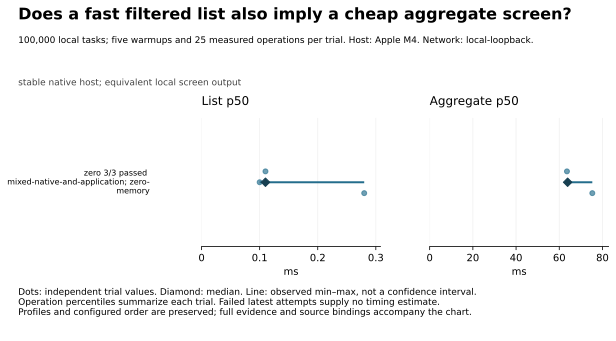

# Benchmark results

**Zero’s list p50 median is 0.11 ms and prefix-search p50 median is 0.14 ms over 100,000 locally available tasks.**

These small loaded-screen latencies answer interaction cost after data is available. They do not measure initial synchronization, and differences below 1 ms do not support a practical superiority claim here.

Campaign `campaign-2026-09-09T11-26-05-626Z`: 3 independent trials per case, in seeded randomized order. Network: local service routes, no injected delay or loss. Host: Apple M4.

[Full tables and explanations](results/reports/campaign-2026-09-09T11-26-05-626Z/DETAILS.md) · [Raw measurements](archive/files/RESULTS.json.gz) · [Methodology](docs/methodology.md)

## Coverage and outcomes

| Suite | zero |
| --- | --- |
| Startup | 2 not run |
| Collaboration | 1 not run |
| Offline recovery | 5 not run |
| Local screens | 2 passed |
| Client fanout and recovery | 2 not run |
| Access revocation | 1 not run |
| Attachments | 1 not run |

Counts describe the latest outcome per case. Failed-trial counts include every failed, invalid or timed-out attempt, even when a later trial passed. “Unsupported” applies only to the tested configuration; “not implemented” and “not run” make no product-capability claim.

Stacks outside this campaign: Syncular, Syncular Rust Client, Electric, Electric + TanStack DB, PowerSync, Turso Sync, Jazz v2 (experimental).

## Findings

### Zero’s list p50 median is 0.11 ms and prefix-search p50 median is 0.14 ms over 100,000 locally available tasks.

How responsive are the native filtered list and prefix search?

100,000 local tasks; five warmups and 25 measured operations per trial. Profile: stable native host; equivalent local screen output. [Full configuration](results/reports/campaign-2026-09-09T11-26-05-626Z/DETAILS.md).

| Stack / client path | Passed / attempted | Latest outcome | List p50 (ms) | Search p50 (ms) |
| --- | --- | --- | --- | --- |
| zero / mixed-native-and-application | 3 / 3 | completed | 0.11 [0.10–0.28] | 0.14 [0.08–0.23] |

Evidence: **unexplained**. The adapter calls native filter, order and limit queries, then projects their output. All three trials return the exact expected rows. This establishes correct native-query execution, but no phase trace isolates query construction, cache work and result projection.

These small loaded-screen latencies answer interaction cost after data is available. They do not measure initial synchronization, and differences below 1 ms do not support a practical superiority claim here.

- [Exact output, sample and native-execution checks for all six Zero trials](archive/files/results/diagnostics/publication-screen-review/FINAL.json.gz)
- [Measured source copies and execution-path inspection; no phase attribution](archive/files/results/diagnostics/zero-native-screen-inspection/INSPECTION.json.gz)

Next experiment: Trace construction, local query execution and projection separately while retaining identical fixture and output checks.

### In Zero’s three native-screen trials, aggregate p50 has a 63.87 ms median and a 63.56–75.30 ms observed range; list p50 has a 0.11 ms median.

Does a fast filtered list also imply a cheap aggregate screen?

Three independent attempts per client; dots show trial values and lines show observed ranges. See the companion for exact numbers.

Evidence: **supported hypothesis**. The aggregate path asks Zero for project tasks and then groups and sorts them in JavaScript. The list uses native filtering, ordering and a limit. Source inspection confirms the different work, but does not separate row materialization from grouping cost or establish their individual contribution.

Evaluate the actual aggregate screen before choosing an implementation. A fast limited list does not predict the cost of processing a larger result. These measurements describe this adapter’s composition and cannot rank Zero’s query engine against SQL engines.

- [Exact output, sample and native-execution checks for all six Zero trials](archive/files/results/diagnostics/publication-screen-review/FINAL.json.gz)
- [Measured source copies and execution-path inspection; no phase attribution](archive/files/results/diagnostics/zero-native-screen-inspection/INSPECTION.json.gz)
- [Reviewed comparison chart](results/diagnostics/publication-charts/final/zero-application-aggregation.svg)
- [Chart values and exact result bindings](archive/files/results/diagnostics/publication-charts/final/zero-application-aggregation-data.json.gz)
- [Chart generation checksums](archive/files/results/diagnostics/publication-charts/final/zero-application-aggregation.json.gz)

Next experiment: Measure native result materialization and application grouping separately; compare a supported precomputed aggregate with the same output in a distinct profile.

### Zero’s detail-query p50 median is 0.21 ms, while the dashboard p50 median is 47.96 ms across the same three trials.

How does the project detail compare with the organization dashboard?

100,000 local tasks and their related tables; five warmups and 25 measured operations per trial. Profile: stable native host; equivalent local screen output. [Full configuration](results/reports/campaign-2026-09-09T11-26-05-626Z/DETAILS.md).

| Stack / client path | Passed / attempted | Latest outcome | Detail p50 (ms) | Dashboard p50 (ms) |
| --- | --- | --- | --- | --- |
| zero / mixed-native-and-application | 3 / 3 | completed | 0.21 [0.20–0.29] | 47.96 [46.82–51.73] |

Evidence: **supported hypothesis**. Detail uses native relationships, ordering and a limit before projection. The dashboard fetches projects with their task relationships, then counts tasks and sorts projects in JavaScript. Both outputs pass exact checks. The cost split between relationship materialization and application processing remains unmeasured.

Treat detail and dashboard as distinct application workloads even when they share a data model. The dashboard gap exceeds the declared practical threshold, but these observations do not identify a single optimization.

- [Exact output, sample and native-execution checks for all six Zero trials](archive/files/results/diagnostics/publication-screen-review/FINAL.json.gz)
- [Measured source copies and execution-path inspection; no phase attribution](archive/files/results/diagnostics/zero-native-screen-inspection/INSPECTION.json.gz)

Next experiment: Trace relationship materialization and task counting, then test a supported aggregate representation under unchanged correctness checks.

## Reading these results

Server volumes and writable layers are retained under the declared preparation policy. Physical-state observations are linked in the full report; logical fixture resets do not establish fresh storage.

Cells summarize independent trial values: median and observed min–max range with fewer than five successes, or median and 95% bootstrap interval with at least five. † marks an interval wider than 25% of the median; treat that estimate as imprecise. Operation percentiles remain distinct from trial counts. A failed latest attempt has no speed estimate; earlier failures remain in the coverage summary and full tables. Different profiles appear in separate tables.

Stopping rule: Run exactly three independent attempts per configured adapter/case, counting failures and unavailable cases. User capped the replacement runs at three on 2026-09-08. Use published Syncular 0.17.0 for both JS and Rust. No selective retries or pooling pre-tuning, old-version or smoke results. Report medians and observed ranges; confidence intervals remain unavailable with fewer than five successful independent trials.

[Exact benchmark source snapshot](archive/files/results/sources/8ecde51941dc281ad277fea9b6a28b7165e0c72cc9202d1fbb71c64201ca9a03/SOURCE.json.gz). [Installed dependency inventory](archive/files/results/dependencies/8fcfee81dbc5a09251577cb486a4540bd61c224166ba85b347284c442ed6472e/DEPENDENCIES.json.gz) records host package and native addon checksums. [Runtime and service configuration](archive/files/results/configurations/20bcba669bb6f49f0e2010ae80eb171f1e016168c79ce09ca0dcb959727d99d9/CONFIGURATION.json.gz) records overrides, resolved services and mounted configuration inputs. Raw operation samples, resource windows, output checks and configuration are in the measurements. Source revision: `5c8131394c20cba5a575b24dfe7053e99b25d7b7`; dirty: true.

Historical measurements predating the shared contracts remain in [the archive](results/history/2026-09-05/README.md).
